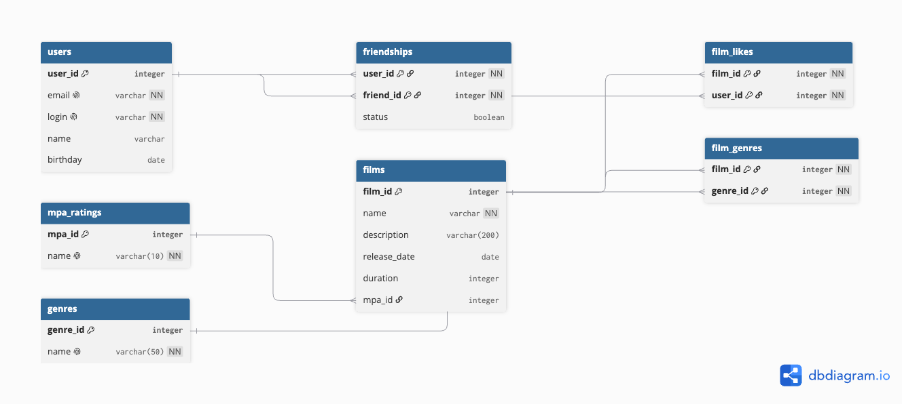

# Схема базы данных Filmorate



## Описание структуры базы данных

Схема спроектирована в соответствии с правилами третьей нормальной формы (3NF):
1. **1NF**: Все атрибуты атомарны (массивы жанров и лайков вынесены в отдельные промежуточные таблицы).
2. **2NF**: Таблицы со составными первичными ключами (`film_genres`, `film_likes`, `friendships`) содержат атрибуты, зависящие от всего ключа целиком.
3. **3NF**: Нет транзитивных зависимостей — рейтинги MPA и жанры вынесены в отдельные справочники (`mpa_ratings`, `genres`).

---

## Примеры основных SQL-запросов

### 1. Получение всех фильмов
```sql
SELECT f.film_id,
       f.name,
       f.description,
       f.release_date,
       f.duration,
       m.name AS mpa_name
FROM films AS f
LEFT JOIN mpa_ratings AS m ON f.mpa_id = m.mpa_id;
```
### 2. Получение фильма по ID
```sql
SELECT f.film_id,
       f.name,
       f.description,
       f.release_date,
       f.duration,
       m.name AS mpa_name
FROM films AS f
LEFT JOIN mpa_ratings AS m ON f.mpa_id = m.mpa_id
WHERE f.film_id = 1;
```
### 3. Топ N наиболее популярных фильмов
```sql
SELECT f.film_id,
       f.name,
       f.description,
       f.release_date,
       f.duration,
       m.name AS mpa_name,
       COUNT(l.user_id) AS likes_count
FROM films AS f
LEFT JOIN mpa_ratings AS m ON f.mpa_id = m.mpa_id
LEFT JOIN film_likes AS l ON f.film_id = l.film_id
GROUP BY f.film_id, m.name
ORDER BY likes_count DESC
LIMIT 10;
```
### 4. Получение всех пользователей
```sql
SELECT user_id,
       email,
       login,
       name,
       birthday
FROM users;
```
### 5. Список друзей пользователя
```sql
SELECT u.user_id,
       u.email,
       u.login,
       u.name,
       u.birthday,
       f.status AS is_confirmed
FROM users AS u
LEFT JOIN friendships AS f ON u.user_id = f.friend_id
WHERE f.user_id = 1;
```
### 6. Список общих друзей двух пользователей (например, ID=1 и ID=2)
```sql
SELECT u.user_id,
       u.email,
       u.login,
       u.name,
       u.birthday
FROM users AS u
JOIN friendships AS f1 ON u.user_id = f1.friend_id AND f1.user_id = 1
JOIN friendships AS f2 ON u.user_id = f2.friend_id AND f2.user_id = 2;
```